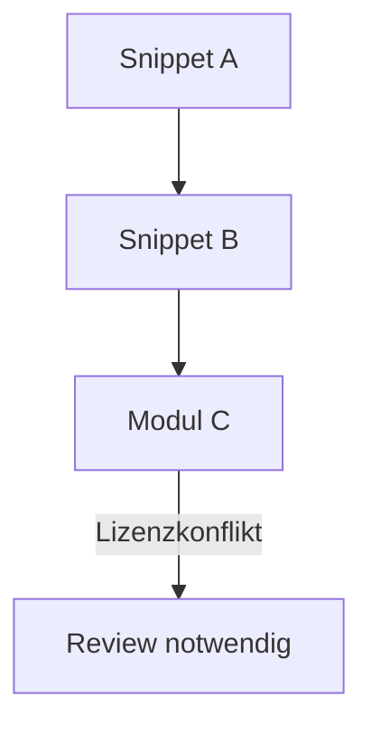

# M13 – Visualmodul für Reuse-Prozesse

## 🧭 Ziel

M13 definiert ein optionales Visualmodul zur **grafischen Darstellung von Reuse-Verläufen, Lizenzverknüpfungen und Entscheidungslogiken** im FRUDEK-System. Ziel ist eine bessere Nachvollziehbarkeit komplexer Abhängigkeiten sowie eine vereinfachte Kommunikation von Lizenz- und Reusepfaden.

---

## 🖼️ Visualisierungstypen

| Typ | Beschreibung | Verwendungszweck |
|-----|--------------|------------------|
| 🔄 Flussdiagramm | Entscheidungsknoten & Reuse-Verzweigungen | Lizenzkonflikt-Analyse |
| 🧭 Pfadgraph | Ursprung → Ableitung | Snippet-Abstammung |
| 🧩 Modularübersicht | Matrix von Reuse & Qualität | Projekt-Statusvisualisierung |
| 🧾 Lizenzmatrix | Lizenzübersicht je Modul | Kompatibilitätsprüfung |

---

## 🧰 Technische Umsetzung (Empfehlung)

- Verwendung von **Mermaid.js**, **Graphviz**, **PlantUML**
- Integration in GitHub-Pages oder statische Doku
- Automatisierte Generierung aus YAML-Metadaten

---

## 🧠 Reuse-Fokus: Visualisierte Fälle

| Visualisierung | Bezieht sich auf |
|----------------|------------------|
| Snippetfluss | M6, M10, M12 |
| Lizenzmatrix | M7, M9 |
| Reuse-Genehmigung | M10, M11 |
| Historienanzeige | M8, M12 |

---

## 🧩 Vorteile

- 👁️ bessere Übersicht bei mehreren Reuse-Ebenen  
- 🛠️ Entscheidungshilfe bei Lizenzüberschneidung  
- 📊 Grundlage für Validierung (M12)  
- 📂 exportierbar als PNG, SVG, PDF

---

## 🔗 Verbindungen

- basiert auf: M6, M7, M8, M9, M10, M11  
- wird verwendet in: M12, M14  
- optionales Ergänzungsmodul für Visualisierung, kein Pflichtbestandteil

---